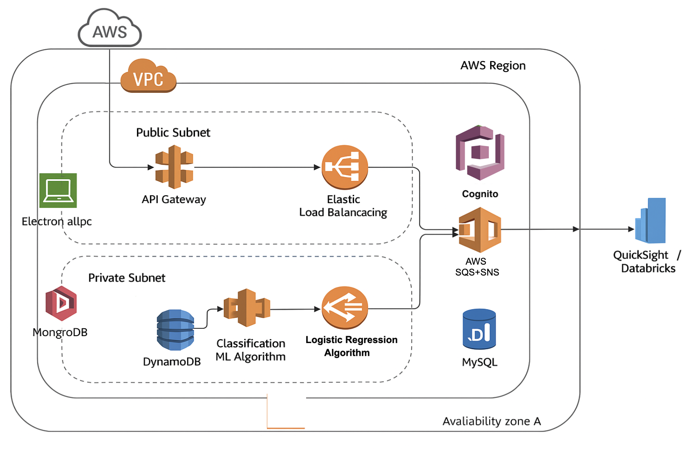
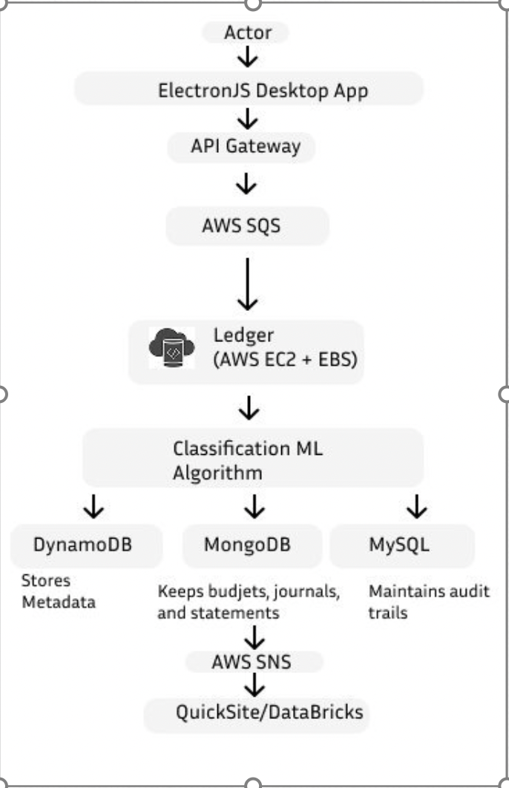

# Show Me The Money 💰

**Architectural Kata Project | CS7346 | Group 10**  
**Authors:** Monarch Nigam, Balakrishnan Arumugam

---

## Project Overview

"**Show Me The Money**" is an AWS-based architectural design for a **next-generation desktop accounting system** for a community college with over 1,000 users, including faculty, administrative staff, and remote users.

The project was focused on designing a **secure, scalable, reliable, and cost-effective system**, while strictly adhering to key client requirements — especially the constraint that **the system must not be web-based**.

This project was presented to a **class of 39 students and the professor** as part of a professional evaluation.

> **Note:** This is a conceptual architecture and design solution. The system was architected, diagrammed, and documented but not implemented. The detailed Solution Report is attached in this repo by the name of **ShowMeTheMoney_Group_10.pdf** 

---

## Problem Statement

The college needed a **new desktop-based accounting solution** that:

- Follows standard accounting practices
- Allows minor departmental workflow customizations
- Maintains a full audit trail of all fiscal transactions
- Is **not** web-based (runs as a desktop application)
- Is cost-effective and easy to maintain

## Key Architectural Highlights

- **Desktop Frontend:** ElectronJS-based cross-platform application (Windows, Mac, Linux)
- **API Gateway + SQS:** Secure, decoupled communication with backend
- **Backend Services:** Hosted on AWS EC2 with EBS storage
- **Data Storage:**
  - Amazon RDS (MySQL) for audit logs
  - MongoDB (self-hosted on AWS) for financial documents
  - DynamoDB for high-speed metadata
- **Security:**
  - AWS Cognito and IAM for authentication and access control
  - Encryption at rest and in transit with AWS KMS
- **Analytics:**
  - AWS QuickSight dashboards
  - Optional integration with Databricks for machine learning
- **Monitoring:** Amazon CloudWatch for real-time metrics and alerts

## AWS Services Used

- Amazon EC2 + Elastic Block Store (EBS)
- Amazon SQS (Simple Queue Service)
- Amazon SNS (Simple Notification Service)
- Amazon API Gateway
- Amazon DynamoDB
- Amazon RDS (MySQL)
- MongoDB (self-hosted)
- AWS IAM (Identity and Access Management)
- Amazon CloudWatch
- AWS QuickSight
- Databricks (optional, for advanced analytics)
- AWS Auto Scaling + Elastic Load Balancing

## Architecture Diagram

> 

## Workflow Diagram

> 

## Key Features

- **Secure Audit Trails:** Immutable logging of every financial transaction
- **Role-Based Access Control:** Fine-grained permission management for Students, Faculty, Admins, Finance Staff, and Auditors
- **Hybrid Database Architecture:** Using both SQL and NoSQL to balance structured and flexible data storage
- **Real-Time Notifications:** Via Amazon SNS for approvals, budget thresholds, and alerts
- **Anomaly Detection (Optional):** Machine learning integration for fraud detection

## Risks & Mitigation Strategies

- **Misconfigured Cloud Services:** AWS Config and Trusted Advisor checks
- **Audit Trail Gaps:** Real-time logging with CloudWatch and Lambda triggers
- **Financial Data Errors:** System-wide validations and ML-powered anomaly detection
- **Single Points of Failure:** Multi-AZ deployments and Auto Scaling for resilience

## Presentation Validation

This project was **presented and defended** before a class of **26 students and the professor** during the course CS7346 as part of an architectural kata assignment.

## Conclusion

"Show Me The Money" represents a thoughtful, industry-grade architectural design for cloud-native, hybrid desktop applications. Even without direct implementation, this project demonstrates:

- AWS architectural skills
- Design thinking and trade-off analysis
- Documentation and communication skills
- Problem-solving in constrained environments

> **Thank you for checking out this project!**

---

## tags: 
#AWS #CloudArchitecture #Serverless #AccountingSystem #ElectronJS #CloudSecurity #AWSProjects #ArchitectureKata #SolutionArchitecture

---

# License

This project is open for educational purposes. All architecture, designs, and diagrams are intellectual property of the authors. Feel free to reference or share with attribution.
